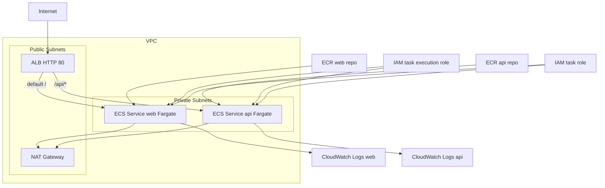

# Architecture Foundation

## 1. Goal of the repository

1. Provide a production oriented baseline for deploying a web service and an API service on AWS ECS Fargate.
2. Keep the repository simple, explicit, and safe for future extension across environments.
3. Establish one source of truth for platform architecture decisions and foundation boundaries.

## 2. What foundation means for this repo

1. Foundation means the minimum platform baseline that is deployable and testable in AWS.
2. Foundation includes monorepo structure, container builds, core infrastructure, health checks, logs, and scaling basics.
3. Foundation does not include advanced release automation, full security hardening, or product specific runtime features.

## 3. High level architecture, ECS Fargate baseline

1. One VPC with two public subnets and two private subnets.
2. One internet facing ALB in public subnets.
3. One HTTP listener on port 80.
4. One listener rule routes `/api/*` to the API target group with higher priority.
5. One default action routes all other paths to the web target group.
6. Two ECS services run on Fargate in private subnets, one web service and one API service.
7. Two ECR repositories store container images, one for web and one for API.
8. Two CloudWatch log groups collect service logs, one for web and one for API.
9. NAT egress is provided by one NAT gateway.

## 4. Repository structure and ownership boundaries

1. `apps/web` contains the Next.js web app, static export configuration, and nginx runtime config.
2. `apps/api` contains the Fastify API service and health endpoint implementation.
3. `libs/contracts` contains shared TypeScript contracts used by web and API.
4. `infra/terraform` contains Terraform modules and variables for AWS infrastructure.
5. `.github` contains governance templates.
6. `.github/workflows` is the future location for CI workflows, currently not part of this baseline.

## 5. Deployment flow, local to CI to AWS

1. Local development flow:
   1. Install dependencies with `npm install`.
   2. Build and test with Nx targets.
   3. Build local Docker images for web and API.
2. Current deployment flow:
   1. Push images to ECR.
   2. Apply Terraform with account specific variables.
   3. Validate ALB routes and health endpoint.
3. Planned CI flow:
   1. Run lint, type check, test, and build targets on pull requests.
   2. Build and publish immutable images after merge.
   3. Execute Terraform plan and controlled apply with approvals.

## 6. Initial decision log

1. ECS over EKS:
   1. Chosen for lower operational overhead and faster baseline delivery.
   2. Reevaluate only if workload scale or platform requirements justify Kubernetes control.
2. ALB over NLB:
   1. Chosen for HTTP path based routing and direct support for `/api/*` rule logic.
   2. NLB remains an option for TCP or ultra low latency requirements outside this baseline.
3. Terraform over CDK:
   1. Chosen for explicit infrastructure state and straightforward team portability.
   2. CDK may be revisited if higher level abstractions become necessary.
4. Nx for monorepo:
   1. Chosen for clear project boundaries and consistent task execution across apps and libs.
   2. Supports shared contracts and scalable workspace management as services grow.

## 7. Open questions

1. What remote state backend and locking approach will be adopted for Terraform.
2. What CI platform and release approval model will be used.
3. When HTTPS on port 443 with ACM and redirect from port 80 will be introduced.
4. What secret management path will be adopted for runtime configuration.
5. What observability baseline beyond logs and health checks is required for first production release.

## 8. Diagram

## 9. Production readiness checklist

1. [x] VPC network baseline is defined with public and private subnets.
2. [x] ALB routing baseline is defined for web and API.
3. [x] ECS services are isolated in private subnets.
4. [x] Health checks are defined for web and API target groups.
5. [x] CloudWatch log groups are defined per service.
6. [x] Basic autoscaling policies are defined for both services.
7. [ ] HTTPS listener with ACM is not implemented yet.
8. [ ] CI plan and apply controls are not implemented yet.
9. [ ] Remote Terraform state backend is not implemented yet.
